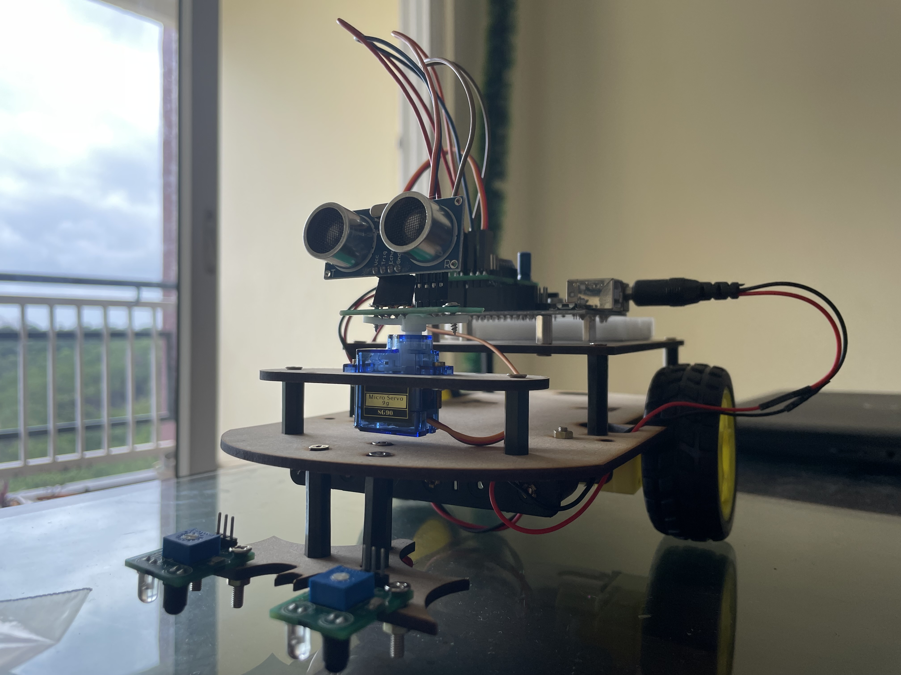
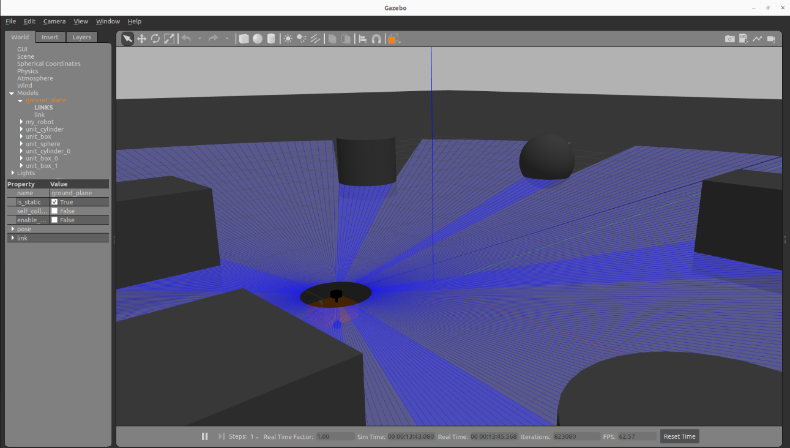

# ViAD-Robo-Navigation-System

It integrates **Vision Transformers (ViT)** for perception, **LLMs** for reasoning, and **Decision Transformers (DT)** for low-level control, all built on **ROS 2 Humble** with Gazebo simulation and Arduino hardware. 
- **Vision Transformers** for semantic scene understanding  
 ### **LLMs** to interpret natural-language commands and choose subgoals  
### **Decision Transformers** for data-driven low-level control  
### **ROS 2 + Gazebo** for simulation-to-real transfer  
### **Arduino Nano + Sensors** for affordable hardware deployment
Below you’ll find:

- **Software prerequisites**  
- **Hardware requirements**
- **Setup & build instructions**  
- **How to run the Gazebo simulation**  
- **How to deploy on real hardware**  
- **Dataset + Training (Decision Transformer)**  

  

    
  

  

    
  

---

## 📋 Prerequisites

### Software

1. **Operating System**  
   - Windows 10 (2004+) or Windows 11 with WSL 2 support  
   - Ubuntu 22.04 under WSL 2  
2. **IDE & Extensions**  
   - Visual Studio Code on Windows  
   - **Remote – WSL** extension  
3. **ROS 2 & Gazebo**  
   - ROS 2 Humble Hawksbill (`ros-humble-desktop`)  
   - Gazebo 11 (`gazebo`, `libgazebo-dev`)  
   - ROS 2–Gazebo bridge packages (`ros-humble-gazebo-ros-pkgs`, `ros-humble-gazebo-plugins`)  
4. **Build Tools**  
   - Python 3 & pip  
   - `python3-colcon-common-extensions`  

### Hardware
 
**Core components you’ll need:**

- **Microcontroller:** Arduino Nano (or Uno)  
- **Motor driver:** L293D (or L298N) dual H-bridge  
- **Drive:**  
  - 2 × DC motors + wheels  
  - Differential‐drive chassis (3D-printed or laser-cut)  
- **Sensors:**  
  - 3 × IR line-tracking sensors (e.g. TCRT5000)  
  - 1 × HC-SR04 ultrasonic distance sensor  
- **Power & wiring:**  
  - 6 × AA or 7.4 V LiPo battery pack  
  - Jumper wires & breadboard  
- **Extras (optional):** IMU, LiDAR, LiPo charger, enclosure  

---

## Install ROS and Gazebo deps
- sudo apt update
- sudo apt install -y \
- curl gnupg lsb-release \
- ros-humble-desktop \
- gazebo libgazebo-dev \
- ros-humble-gazebo-ros-pkgs ros-humble-gazebo-plugins \
- python3-colcon-common-extensions

## Build the workspace
### Source ROS 2
source /opt/ros/humble/setup.bash

### Build
colcon build --merge-install

### Overlay
source install/setup.bash

## ▶️ Running Simulation
#### Launch Gazebo simulation
ros2 launch rav_bot rav_gazebo.launch.py

#### Run ViT perception node
ros2 run rav_bot perception_node

#### Run LLM planner
ros2 run rav_bot llm_planner_node --ros-args --param model=phi-3-mini

# Run Decision Transformer policy
ros2 run rav_bot policy_server_node --ros-args --param ckpt=dt_best.ckpt

##  Deploying on Real Hardware
#### Flash Arduino firmware
arduino-cli upload -p /dev/ttyUSB0 --fqbn arduino:avr:nano firmware/

#### Start micro-ROS agent
ros2 run micro_ros_agent micro_ros_agent serial --dev /dev/ttyUSB0

#### Send velocity commands
ros2 topic pub /rav_bot/cmd_vel geometry_msgs/Twist ...

#### Dataset + Training (Decision Transformer)
#### Collect expert rollouts
ros2 launch rav_bot nav2_expert.launch.py --ros-args -p record:=true

#### Train DT
python train_dt.py --dataset data/rosbags --config configs/dt.yaml

#### Evaluate in Gazebo
ros2 run rav_bot policy_server_node --ros-args -p ckpt=outputs/dt_best.ckpt

